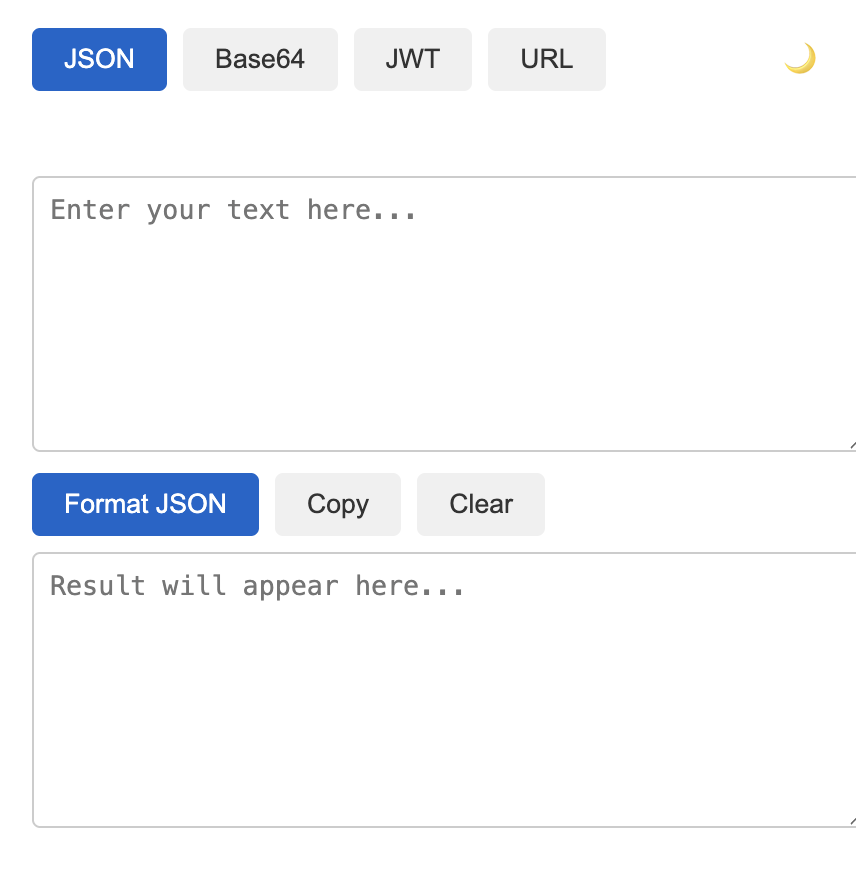

# Dev Toolkit

A lightweight Chrome extension providing developer utilities for encoding, decoding, and formatting.

Zero dependencies. Zero permissions. Manifest V3.

<br/>

## Screenshot



<br/>

## Features

### JSON Formatter & Validator
- Format JSON with proper indentation
- Validate JSON syntax
- Support for nested objects and arrays

### Base64 Encoder/Decoder
- Encode text to Base64
- Decode Base64 to text
- Validate Base64 format

### JWT Token Tools
- Encode JSON payload to JWT
- Decode JWT tokens
- View header, payload, and signature

### URL Encoder/Decoder
- Encode URLs with special characters
- Decode URL-encoded strings
- Support for query parameters

### Timestamp Converter
- Unix timestamp to date (auto-detect seconds/milliseconds)
- Date string to Unix timestamp
- UTC and local time display

### Hash Generator
- SHA-1, SHA-256, SHA-384, SHA-512
- Web Crypto API based

### UUID Generator
- UUID v4 generation
- Batch generation (up to 100)

### Color Converter
- Auto-detect HEX, RGB, HSL input
- Convert to all three formats

### Diff Viewer
- Line-by-line text comparison
- Summary with added/removed/unchanged counts

### Dark Mode
- Toggle between light and dark themes
- Persistent theme preference

### Keyboard Shortcuts
- `Ctrl+Enter` — Execute conversion
- `Ctrl+Shift+C` — Copy result
- `Alt+1-9` — Switch tabs

See [Features](docs/FEATURES.md) for detailed usage and examples.

<br/>

## Installation

<br/>

### Chrome Web Store
1. Visit [Dev Toolkit](https://chromewebstore.google.com/detail/dev-toolkit/docgjoppdhbahapgbemfadlkgchnmecc)
2. Click "Add to Chrome"

<br/>

### From Source
```bash
git clone https://github.com/somaz94/dev-toolkit-google-extension.git
cd dev-toolkit-google-extension
```
1. Open Chrome > `chrome://extensions/`
2. Enable "Developer mode"
3. Click "Load unpacked" and select the project directory

<br/>

## Usage

1. Click the extension icon in Chrome
2. Select a tool tab (JSON, Base64, JWT, URL)
3. Choose mode (Encode/Decode) if applicable
4. Input text and click the action button
5. Copy the result with the Copy button

<br/>

## Examples

<br/>

### JSON Formatting
```json
Input: {"name":"John","age":30,"city":"New York"}

Output:
{
  "name": "John",
  "age": 30,
  "city": "New York"
}
```

<br/>

### Base64
```
Encode: Hello World! → SGVsbG8gV29ybGQh
Decode: SGVsbG8gV29ybGQh → Hello World!
```

<br/>

### JWT Decode
```
Input: eyJhbGciOiJIUzI1NiJ9.eyJzdWIiOiIxMjM0NTY3ODkwIn0...

Output:
Header: { "alg": "HS256" }
Payload: { "sub": "1234567890" }
```

<br/>

### URL
```
Encode: https://example.com?name=John Doe → https%3A%2F%2Fexample.com%3Fname%3DJohn%20Doe
Decode: https%3A%2F%2Fexample.com%3Fname%3DJohn%20Doe → https://example.com?name=John Doe
```

<br/>

### Timestamp
```
Timestamp → Date:
Input: 1711270800
Output: UTC: 2024-03-24 07:00:00 UTC / Local: 03/24/2024, 16:00:00 KST

Date → Timestamp:
Input: 2026-03-24 (or "now")
Output: Seconds: 1774440000 / Milliseconds: 1774440000000
```

<br/>

### Hash
```
Input: Hello World!
Output:
SHA-1:   2ef7bde608ce5404e97d5f042f95f89f1c232871
SHA-256: 7f83b1657ff1fc53b92dc18148a1d65dfc2d4b1fa3d677284addd200126d9069
```

<br/>

### UUID
```
Input: 3 (or empty for 1)
Output:
550e8400-e29b-41d4-a716-446655440000
6ba7b810-9dad-11d1-80b4-00c04fd430c8
f47ac10b-58cc-4372-a567-0e02b2c3d479
```

<br/>

### Color
```
Input: #ff6347
Output:
HEX: #ff6347
RGB: rgb(255, 99, 71)
HSL: hsl(9, 100%, 64%)
```

<br/>

### Diff
```
Input:
hello world
---
hello earth

Output:
[Summary] +1 added, -1 removed, 0 unchanged
  - hello world
  + hello earth
```

<br/>

## Project Structure

```
dev-toolkit-google-extension/
├── manifest.json              # Chrome extension config (Manifest V3)
├── Makefile                   # Build, test, package commands
├── src/
│   ├── popup/
│   │   ├── popup.html         # UI markup
│   │   ├── popup.js           # Event handling & orchestration
│   │   └── popup.css          # Light/dark theme styling
│   └── utils/
│       ├── jsonFormatter.js   # JSON formatting & validation
│       ├── base64Utils.js     # Base64 encode/decode
│       ├── jwtDecoder.js      # JWT token decoding
│       ├── jwtEncoder.js      # JWT token encoding (HMAC-SHA256)
│       ├── urlUtils.js        # URL encode/decode
│       ├── timestampUtils.js  # Unix timestamp conversion
│       ├── hashUtils.js       # Hash generation (SHA-1/256/384/512)
│       ├── uuidUtils.js       # UUID v4 generation
│       ├── colorUtils.js      # Color conversion (HEX/RGB/HSL)
│       ├── diffUtils.js       # Line-by-line text diff
│       └── validator.js       # Input validation
├── tests/                     # Unit tests (Jest)
├── hack/                      # Scripts (bump-version)
├── icons/                     # Extension icons (16, 48, 128px)
├── docs/                      # Documentation
└── .github/workflows/         # CI/CD
```

<br/>

## Tech Stack

- JavaScript (ES6 Modules) — no bundler, no dependencies
- HTML5 / CSS3 with CSS custom properties
- Chrome Extension Manifest V3
- Native browser APIs (Clipboard, localStorage, Web Crypto)

<br/>

## Documentation

- [Features](docs/FEATURES.md) - Detailed usage and examples for all tools
- [Development](docs/DEVELOPMENT.md) - Setup, local development, adding tools, Chrome Web Store publishing

<br/>

## Contributing

Pull requests are welcome. For major changes, please open an issue first.

<br/>

## License

[MIT](LICENSE)
